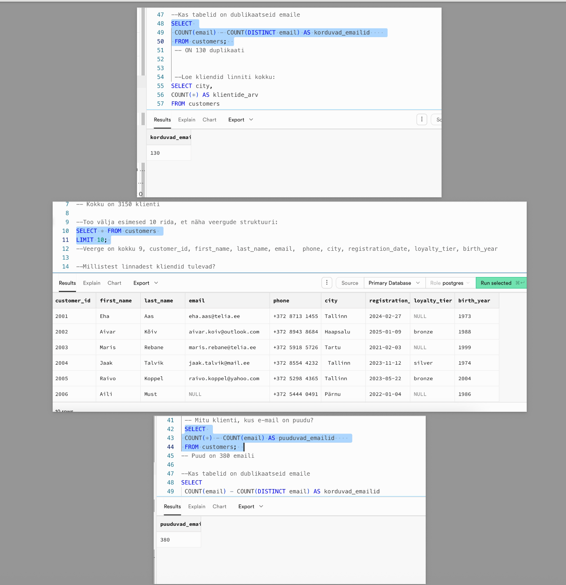

# Nädal 1: SQL-i alused — UrbanStyle'i andmete uurimine

## Minu roll

Roll B: kliendiandmete uurija. Analüüsisin `customers` tabeli struktuuri, kirjeldavaid näitajaid ja andmekvaliteeti.

## Mida ma tegin
- Uurisin `customers` tabelit SQL-päringutega.
- Tuvastasin korduvad e-posti aadressid.
- Uurisin puuduvaid väärtusi ja andmekvaliteeti.

## Peamised leiud
- `customers` tabelis on 3150 rida.
- Korduvaid e-posti aadresse on 130.
- E-posti aadress puudub 380 kliendil.

## Peamised õppetunnid
- `SELECT`, `FROM`, `WHERE`, `ORDER BY` ja `LIMIT`.
- `DISTINCT` ja `COUNT` korduste tuvastamiseks.
- Puuduvate väärtuste leidmine `IS NULL` abil.

## Failid

- [Minu SQL-päringud](individual/week1_customers_exploration.sql)
- [Tulemuste kuvatõmmis](individual/week1_results_screenshot.png)

## Meeskonna töö

- [Meeskonna andmemaastiku kokkuvõte](team/README.md)
- [Meeskonna slaidid](https://docs.google.com/presentation/d/1dy4WZY9-amFs1SLXhjyp3hn9sgC6R1XiVZKb0keOdTw/edit?slide=id.g3ddb8b9f226_0_140#slide=id.g3ddb8b9f226_0_140)
