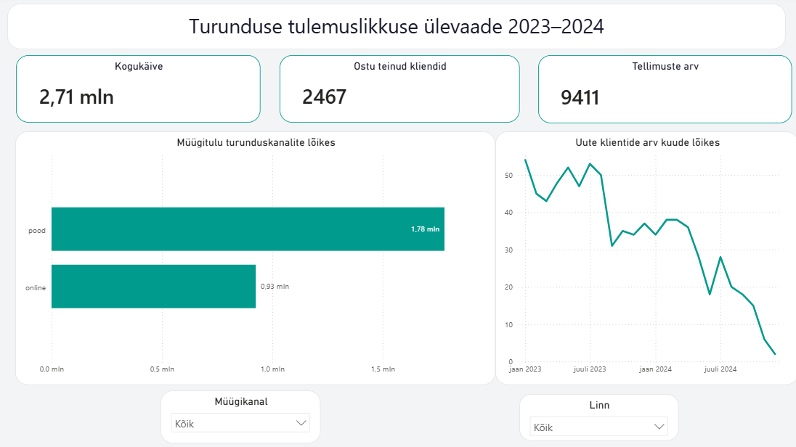

# Nädal 5: visualiseerimise disain

## Minu roll ja eesmärk

Roll B: turunduse dashboard. Koostasin Power BI-s juhtimisvaate, mis näitab turunduskanalite efektiivsust ja kliendihankimise mustrit aastatel 2023–2024.

## KPI-d ja visuaalid

- kogukäive;
- ostu teinud klientide arv;
- tellimuste arv;
- tulpdiagramm online- ja poekanali müügitulu võrdlemiseks;
- joondiagramm uute klientide kuise trendi näitamiseks;
- müügikanali ja linna filtrid.

## Disainiotsused

Paigutasin KPI-d vaate ülaossa, et põhinumbrid oleksid kohe nähtavad. Kanalite võrdluseks kasutasin tulpdiagrammi ja ajatrendi jaoks joondiagrammi. Piiratud värvipalett, selged pealkirjad ja filtrite eraldi ala aitavad vähendada visuaalset müra. Andmeallika päringud ja mudel asuvad PBIX-failis.

## Äritõlgendus

Poekanal teenis perioodil suurema käibe kui online-kanal. Uute klientide arv näitab perioodi lõpus langustrendi, mis võib viidata turundustegevuste vähenemisele või klientide huvi langusele. Soovitan võrrelda kampaaniate tulemusi kanaliti ning suunata kliendihankimise eelarve kanalitesse, mis toovad rohkem uusi kliente.

## Väljundid

- [Power BI dashboard](individual/dashboard/urbanstyle_week5_dashboard_sirja.pbix)
- [Dashboardi kuvatõmmis](individual/images/marketing_dashboard_2023_2024.png)
- [Meeskonna investorivaate kirjeldus](team/README.md)
- [Meeskonna koondvaate kuvatõmmis](team/team_week5.png)

## AI kasutamine

Kasutasin AI-d dashboardi infohierarhia, diagrammivalikute ja äritõlgenduse täpsustamiseks. Kontrollisin soovitused oma andmete ja Power BI vaate põhjal üle.
