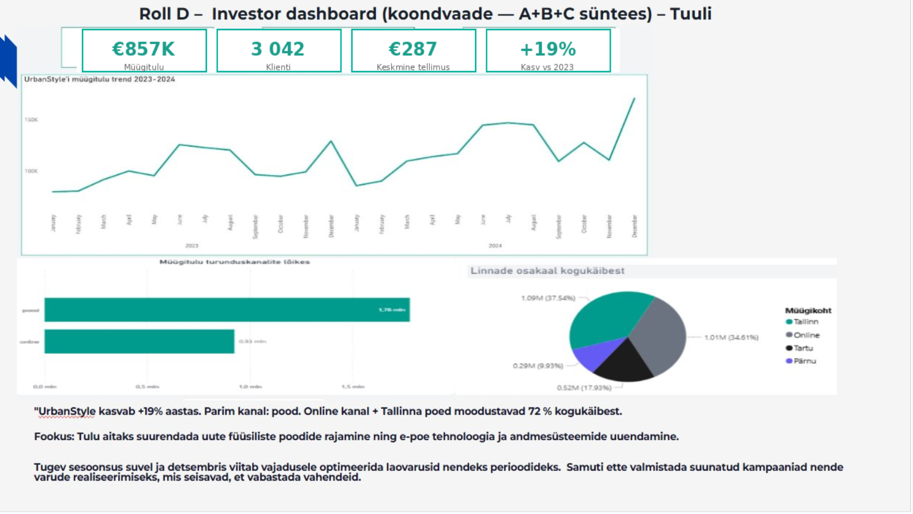

# Nädal 5: investori dashboard

**Roll D:** rollide A, B ja C tulemuste süntees

Investor Dashboard koondab kolme rolli (Müük, Turundus ja Operatsioonid) peamised tulemused ühele juhtimisvaatele, et anda kiire ülevaade ettevõtte üldisest tulemuslikkusest.

### Peamised näitajad

* Müügitulu: 857 000 €
* Kliente: 3 042
* Keskmine tellimuse väärtus: 287 €
* Aastane kasv võrreldes 2023. aastaga: +19%

### Peamised tähelepanekud

**Müügitulu trend**

* Müügitulu näitab aastatel 2023–2024 üldiselt kasvavat trendi.
* Kõrgeimad müügitulemused saavutati 2024. aasta lõpus.
* Võrreldes eelmise aastaga kasvas ettevõtte müügitulu ligikaudu 19%.

**Müügikanalite efektiivsus**

* Füüsiline pood oli kõige tulemuslikum müügikanal.
* Poe müügitulu ületas oluliselt online-kanali müügitulu.
* See viitab klientide eelistusele teha oste füüsilistes kauplustes.

**Müügikohtade osakaal kogukäibest**

* Suurima osa kogukäibest moodustasid Tallinna kauplused.
* Online-kanal oli samuti oluline müügitulu allikas.
* Tallinn ja online-kanal moodustasid kokku ligikaudu 72% ettevõtte kogukäibest.

### Äriline soovitus

Tulemused näitavad, et ettevõtte kasv tugineb peamiselt füüsilistele kauplustele ning tugevale Tallinna turule. Edasise kasvu toetamiseks võiks kaaluda investeeringuid uute kaupluste avamisse piirkondades, kus nõudlus on suur, ning jätkata e-poe arendamist, et säilitada online-kanali konkurentsivõime.

Samuti on müügitulu trendis näha hooajalisust, eriti aasta lõpu perioodidel. Seetõttu on oluline planeerida laovarusid ja turunduskampaaniaid vastavalt nõudluse muutustele, et vältida laoseisu puudujääke ja maksimeerida müügitulu.
